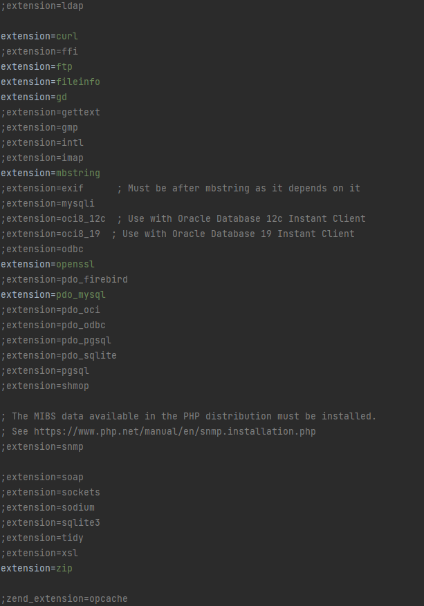

# Overview
This project is a web application to order tickets for buses to festivals through FestivalTravelSystem. This webapp ensures that the users have a comfortable experience buying bus-tickets.  

# Installation guide:
- Clone the repo
After that run the following commands:
- `composer install`
- `npm install`
- `npm run build`

### database setup
- create a database and remember its name

### .env setup
- create a copy of .env-example and rename it to .env
- set DB_DATABASE to be the name of the database you just created
- set a correct DB_USERNAME and DB_PASSWORD
- create a new app key using the command: `php artisan key:generate` 
- run the command:  `php artisan migrate:fresh --seed` to prepare and fill the database with dummy data

### To run the project locally run the following command:
-`composer run dev`
This command opens a server on default url:port http://127.0.0.1:8000

### php.ini config
We have enabled the following extensions in our php.ini to make this project function properly.

We have additionally changed the variables_order:
- From:  `variables_order = "EGPCS"`
- To: &emsp; `variables_order = "GPCS"`

The post_max_size:
- From:  `post_max_size = 2M`
- To: &emsp; `post_max_size = 8M`

And lastly the upload_max_filesize:
- From:  `upload_max_filesize = 2M`
- To: &emsp; `upload_max_filesize = 5M`